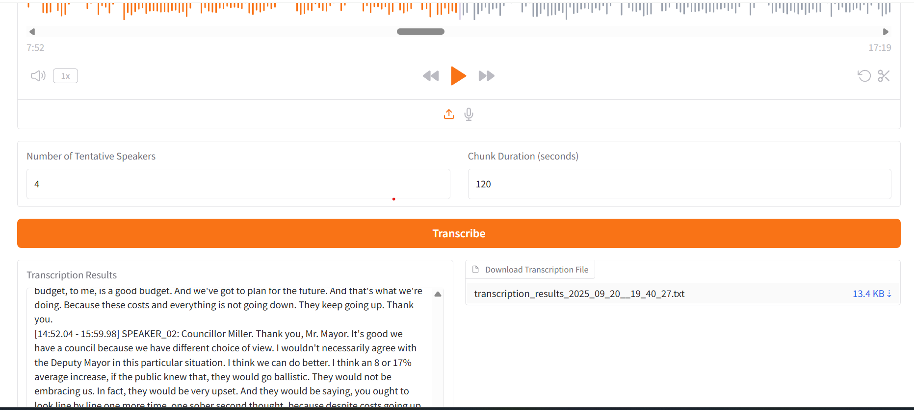

# 🎤 Audio Transcription & Speaker Diarization

[](https://www.python.org/)
[](https://pytorch.org/)
[](https://gradio.app/)
[](LICENSE)

> **Transcribe Large audio files with automatic speaker diarization and a  web interface.**

Uses Nvdia [Parakeet v2](https://huggingface.co/nvidia/parakeet-tdt-0.6b-v2) and [Pyannote](https://huggingface.co/pyannote/speaker-diarization-3.1) models for transcription and diarization.

---

## 🚀 Features

- **Automatic Speech Transcription** (English)
- **Speaker Diarization**: Distinguish between multiple speakers
- **Chunked Processing**: Handles long audio files efficiently
- **Speaker Recognisation**: Correctly recognizes these speakers across all the chunks.  
- **Modern Web UI**: Powered by [Gradio](https://gradio.app/)
- **Downloadable Results**: Get both formatted text and grouped-by-speaker files
- **CPU Only Infernce**: No need for GPU Uses PyTorch and ONNX for fast inference GPU is optional.

---

## 📸 Demo



---

## 🛠️ Setup Instructions

### 1. Clone the Repository

```bash
git clone https://github.com/deepanshu-yadav/big_audio_file_transcription.git
cd big_audio_file_transcription
```

---

### 2. Download Pretrained Models

#### **Diarization Models**

If you choose pyannote models for diarization you need to download the following files. Otherwise if you choose resemblyser then no need.

- **Segmentation Model**  
  Download from [pyannote/segmentation-3.0](https://huggingface.co/pyannote/segmentation-3.0/blob/main/pytorch_model.bin)  
  Then run:
  ```bash
  cp pytorch_model.bin model_components/pyannote/
  mv model_components/pyannote/pytorch_model.bin model_components/pyannote/segmentation-3.0.bin
  ```

- **Embedding Model**  
  Download from [pyannote/wespeaker-voxceleb-resnet34-LM](https://huggingface.co/pyannote/wespeaker-voxceleb-resnet34-LM/blob/main/pytorch_model.bin)  
  Then run:
  ```bash
  cp pytorch_model.bin model_components/pyannote/
  mv model_components/pyannote/pytorch_model.bin model_components/pyannote/wespeaker-voxceleb-resnet34-LM.bin
  ```

#### **Transcription Model**

Download and extract:
```bash
wget https://github.com/k2-fsa/sherpa-onnx/releases/download/asr-models/sherpa-onnx-nemo-parakeet-tdt-0.6b-v2-int8.tar.bz2
tar xvf sherpa-onnx-nemo-parakeet-tdt-0.6b-v2-int8.tar.bz2
rm sherpa-onnx-nemo-parakeet-tdt-0.6b-v2-int8.tar.bz2
```
Copy all `.onnx` and `tokens.txt` files into the `model_components` folder.

---

### 3. Install Dependencies

#### **Python Packages**

```bash
pip install -r requirements.txt
```

#### **FFmpeg (Required for audio processing)**

- **Ubuntu/Debian:**  
  `sudo apt update && sudo apt install ffmpeg`
- **Arch Linux:**  
  `sudo pacman -S ffmpeg`
- **macOS (Homebrew):**  
  `brew install ffmpeg`
- **Windows (Winget):**  
  `winget install Gyan.FFmpeg`
- **Windows (Chocolatey):**  
  `choco install ffmpeg`
- **Windows (Scoop):**  
  `scoop install ffmpeg`

Or download from the [official FFmpeg website](https://ffmpeg.org/download.html).

---

## 💻 Usage

### **Start the Web App**

```bash
python app.py
```

Visit [http://127.0.0.1:7860](http://127.0.0.1:7860) in your browser.

---

### **How to Use**

1. **Upload** your audio file (supports `.wav`, `.mp3`, etc.).
2. **Set** the number of speakers and chunk duration.
3. **Click** "Transcribe".
4. **View** the transcription with speaker labels.
5. **Download** the full results as a text file.

---

## 📂 Project Structure

```
repo/
│
├── app.py                  # Gradio web interface
├── transcript_big_file.py  # Main diarization & transcription logic
├── transcript.py           # Feature extraction & ONNX model handling
├── utils.py                # Utility functions (audio conversion, file writing)
├── requirements.txt        # Python dependencies
├── model_components/       # Place all downloaded models here
│   └── pyannote/
│       ├── config_diarize.yaml
└── README.md
```

---

## ⚡ Future Improvements

- [ ] Support for languages other than English
- [ ] Improved handling of overlapping speakers

---

## 🤝 Contributing

Pull requests and issues are welcome! Please open an issue for bugs or feature requests.

---

## 📄 License

This project is licensed under the MIT License.

---

**Enjoy fast, accurate, and speaker-aware audio transcription!**
